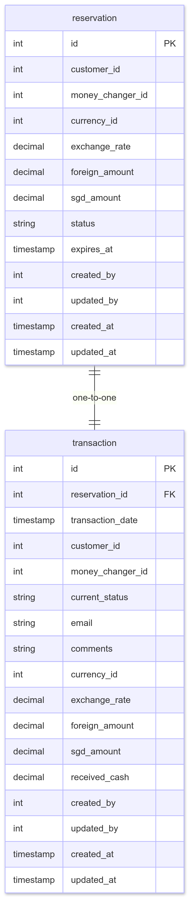

# 💱 MoneyChanger Reservation API

A production-ready backend service for managing money changer reservations and profiles.
Built with Spring Boot, MySQL, and RESTful architecture, the API supports:

* Role-based access (Admin vs Staff)

* Soft delete using isDeleted

* Audit tracking (created_by, updated_by, timestamps)

* Clean layered architecture

* MySQL / AWS RDS compatibility

# 🏗️ Setup Instructions
1.  Requirements

Install the following:

* Java 21

* Maven 3.8+

* MySQL 8.0 (local or AWS RDS)

* (Optional) Docker & Docker Compose

2.  Database Setup
Using Docker (Recommended)

Set environment variables for docker-compose.yml:

```
MYSQL_ROOT_PASSWORD=
MYSQL_DATABASE=
```

Start MySQL:

```
docker-compose up -d
```

Import the SQL scripts located in src/main/resources/dbscript/:
```
reservation_schema.sql

reservation_data.sql
```

Use MySQL terminal or any SQL client to run the scripts.

3.  Application Properties

Set these environment variables (used by application.yml):
```
DB_URL       # e.g. jdbc:mysql://localhost:3306/moneygrab
DB_USERNAME
DB_PASSWORD
```

Ensure the values match your MySQL or RDS configuration.

4.  Run the Application
Using Maven
```
mvn spring-boot:run
```

Using IntelliJ IDEA

Open project

Load Maven dependencies

Run the Spring Boot main class

📁 Project Structure
```
src/main/java/
│
├── config/        # App configuration (datasource, security, beans)
├── controller/    # REST API controllers
├── dto/           # Request/Response DTOs
├── exception/     # Custom exceptions & global handlers
├── mapper/        # DTO-to-entity mappers
├── model/         # JPA entities (database tables)
├── repository/    # Spring Data JPA repositories
└── service/       # Business logic layer
```

Additional Notes

Soft Delete

Records are never physically removed; isDeleted = 1 marks them inactive.

Role-Based Access

accounts.role distinguishes:

ADMIN → full access including delete

STAFF → restricted access

Audit Fields

created_by, updated_by, created_at, updated_at ensure traceability.

AWS-Compatible Design

Fully compatible with AWS RDS for production deployments.

### Reservation Microservice Schema

